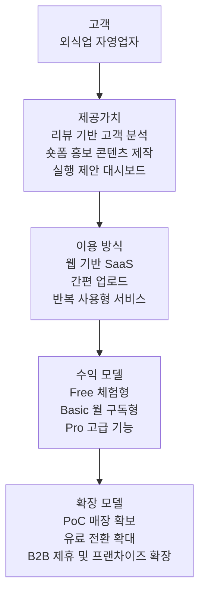
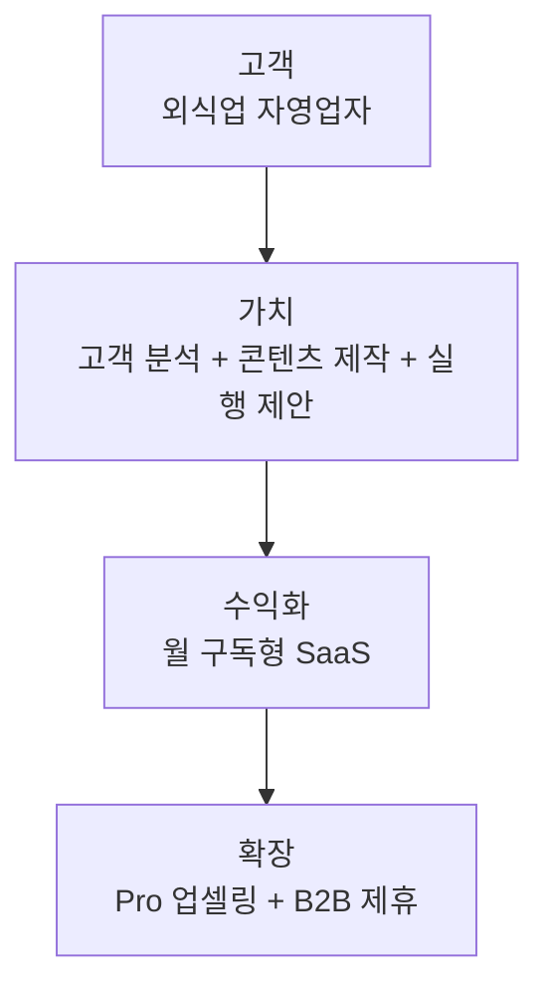

# PULSE 비즈니스 모델 직관형 도식

이 도식은 `서비스 구조도`가 아니라, 심사위원이 바로 이해할 수 있는 `비즈니스 모델` 중심 도식입니다.

핵심 질문 4가지만 보이도록 설계했습니다.

1. `누가 돈을 내는가`
2. `무슨 가치를 받는가`
3. `어떻게 수익화하는가`
4. `어떻게 확장하는가`

## 최종 추천 제목

`PULSE 비즈니스 모델`

## 최종 추천 캡션

`PULSE는 외식업 자영업자에게 리뷰 기반 고객 분석, 숏폼 홍보 콘텐츠 제작, 실행 제안을 통합 제공하고, 월 구독형 SaaS를 기반으로 Pro 업셀링과 B2B 제휴로 확장합니다.`

## 사업계획서 본문용 최종 도식

## 더 압축한 카드형 버전

## 왜 이 구조가 더 적절한가

- `고객`부터 `수익화`까지 한 줄로 읽혀서 심사위원이 빠르게 이해할 수 있습니다.
- 제품 기능 설명보다 `사업모델이 어떻게 성립하는지`가 먼저 보입니다.
- 본문 이미지로 넣었을 때 복잡하지 않고, 옆에 설명 문단을 붙이기 쉽습니다.

## 디자인 팁

- `고객`: 중립색
- `제공가치`: 브랜드 메인컬러
- `수익 모델`: 진한 강조색
- `확장 모델`: 보조 강조색

- 박스는 4~5개만 유지합니다.
- 각 박스는 2~3줄 이내로 끝내는 편이 좋습니다.
- 본문에서는 `최종 도식` 버전을, 발표자료에서는 `카드형 버전`을 쓰는 것을 추천합니다.
