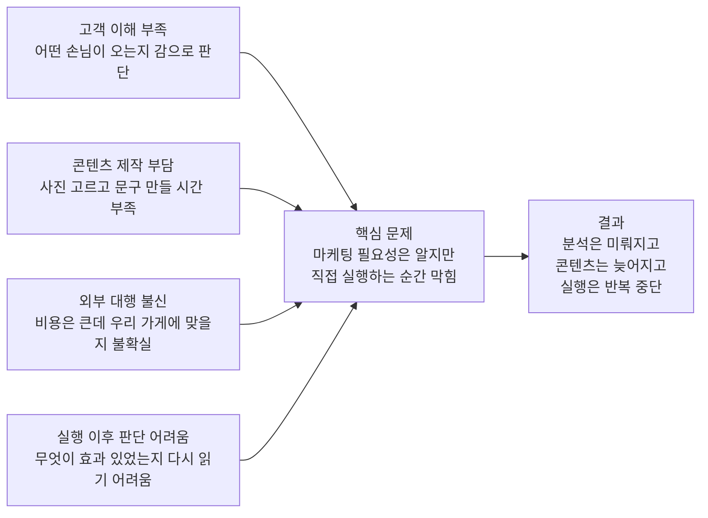
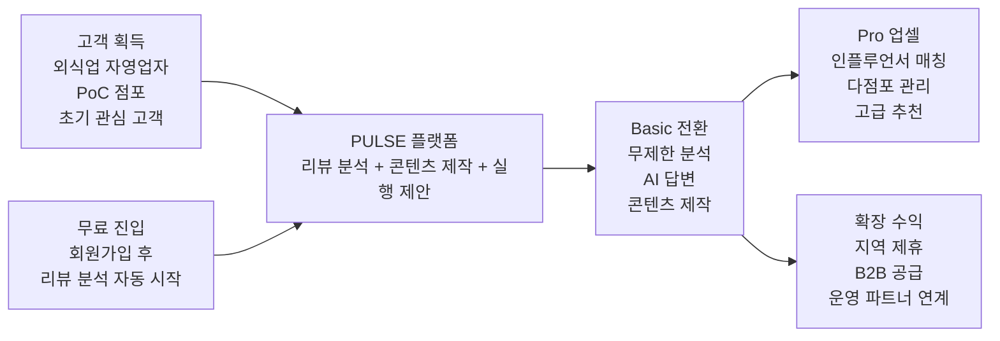
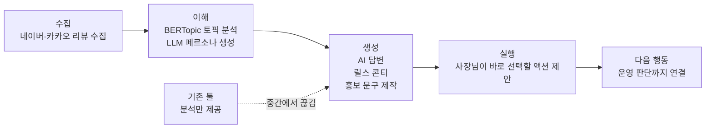

# PULSE 사업계획서 다이어그램 Mermaid

## 1. 문제 검증 자료

```mermaid
flowchart LR
    A["고객 이해 부족<br/>어떤 손님이 오는지 감으로 판단"] --> E["핵심 문제<br/>마케팅 필요성은 알지만<br/>직접 실행하는 순간 막힘"]
    B["콘텐츠 제작 부담<br/>사진 고르고 문구 만들 시간 부족"] --> E
    C["외부 대행 불신<br/>비용은 큰데 우리 가게에 맞을지 불확실"] --> E
    D["실행 이후 판단 어려움<br/>무엇이 효과 있었는지 다시 읽기 어려움"] --> E
    E --> F["결과<br/>분석은 미뤄지고<br/>콘텐츠는 늦어지고<br/>실행은 반복 중단"]
```

## 2. 비즈니스모델 구체화

```mermaid
flowchart LR
    A["고객 획득<br/>외식업 자영업자<br/>PoC 점포<br/>초기 관심 고객"] --> C["PULSE 플랫폼<br/>리뷰 분석 + 콘텐츠 제작 + 실행 제안"]
    B["무료 진입<br/>회원가입 후<br/>리뷰 분석 자동 시작"] --> C
    C --> D["Basic 전환<br/>무제한 분석<br/>AI 답변<br/>콘텐츠 제작"]
    D --> E["Pro 업셀<br/>인플루언서 매칭<br/>다점포 관리<br/>고급 추천"]
    D --> F["확장 수익<br/>지역 제휴<br/>B2B 공급<br/>운영 파트너 연계"]
```

## 3. 기술 차별성 설명 자료

```mermaid
flowchart LR
    A["수집<br/>네이버·카카오 리뷰 수집"] --> B["이해<br/>BERTopic 토픽 분석<br/>LLM 페르소나 생성"]
    B --> C["생성<br/>AI 답변<br/>릴스 콘티<br/>홍보 문구 제작"]
    C --> D["실행<br/>사장님이 바로 선택할 액션 제안"]
    D --> E["다음 행동<br/>운영 판단까지 연결"]

    X["기존 툴<br/>분석만 제공"] -.중간에서 끊김.-> C
```
