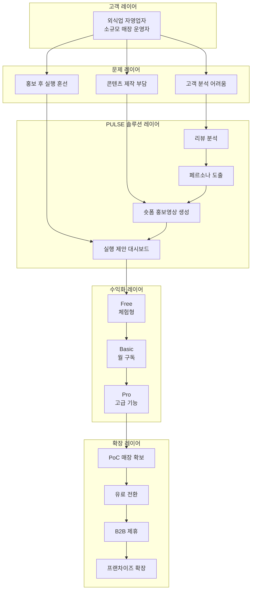
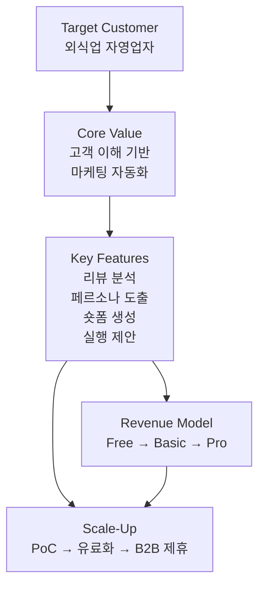
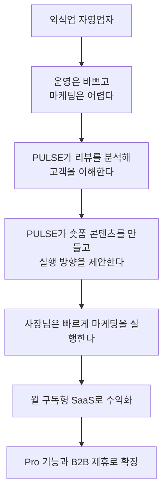

# PULSE 2026 예비창업패키지 이미지 삽입 가이드

## 1. 사업계획서 본문 이미지 3종

### 본문용 이미지 1

- 위치: `1페이지 요약 영역`
- 문서 내 표기: `[본문용 이미지 1 첨부: PULSE 메인 화면 또는 한 장 요약 서비스 화면]`
- 권장 내용: 서비스 전체 흐름이 한눈에 보이는 대표 화면
- 목적: 심사위원이 첫 페이지에서 아이템 정체성을 즉시 이해하도록 함

### 본문용 이미지 2

- 위치: `실현 가능성 섹션 초입`
- 문서 내 표기: `[본문삽입: MVP 대표 화면 1장 - 메인 대시보드 또는 랜딩 화면]`
- 권장 내용: 실제 구현된 MVP 대표 화면 1장
- 목적: 아이디어가 아니라 실제 개발 완료 상태임을 직관적으로 증명

### 본문용 이미지 3

- 위치: `성장전략 섹션 후반`
- 문서 내 표기: `[본문삽입: 비즈니스 모델 도식 또는 사업 확장 로드맵 중 1개 선택]`
- 권장 내용: 수익화 구조 또는 확장 단계가 명확히 보이는 도식 1장
- 목적: 사업화 가능성과 확장성을 간결하게 설득

## 2. 별첨 2 기타 증빙서류 이미지 4세트

### 붙임 7-1

- 자료명: `KCI 논문 등재 증빙`
- 권장 삽입물: KCI 검색 결과 화면 또는 논문 첫 페이지 캡처

### 붙임 7-2

- 자료명: `MVP 상세 화면 캡처`
- 권장 삽입물:
  - 리뷰 분석 및 페르소나 도출 화면
  - 홍보영상 생성 화면

### 붙임 7-3

- 자료명: `프로젝트 전체 기술 아키텍처`
- 권장 삽입물: 프론트엔드, 메인 백엔드, AI 서버가 함께 보이는 구조도

### 붙임 7-4

- 자료명: `사용자 흐름도`
- 권장 삽입물: 고객 이해 → 홍보 제작 → 실행 제안 흐름도

## 3. 실제 제출 순서

1. `[붙임 1]` 신분증 사본
2. `[붙임 7-1]` KCI 논문 등재 증빙
3. `[붙임 7-2]` MVP 상세 화면 캡처
4. `[붙임 7-3]` 프로젝트 전체 기술 아키텍처
5. `[붙임 7-4]` 사용자 흐름도

## 4. 편집 팁

- 본문은 `핵심 설득` 중심으로 3장만 유지합니다.
- 상세 구현 증빙은 모두 `별첨 2`로 보냅니다.
- 각 별첨 상단에는 `[붙임 7-1]`, `[붙임 7-2]` 같은 표기를 그대로 남겨두는 편이 좋습니다.
- 신분증은 주민등록번호 뒷자리를 반드시 마스킹합니다.

## 5. 비즈니스 모델 도식 추천안

단순한 세로 화살표형보다, `문제 해결 구조`, `수익 구조`, `확장 구조`가 동시에 보이는 편이 더 설득력 있습니다. 아래 3안은 Word 본문 폭 안에서도 비교적 안정적으로 들어가면서, 시각적으로도 더 완성도 있게 보이도록 잡은 형태입니다.

### A안. 레이어형 가치사슬 도식

- 용도: 본문에 `대표 비즈니스 모델 이미지` 1장으로 넣기 가장 좋음
- 인상: 서비스가 체계적으로 설계된 느낌을 줌
- 핵심: 고객, 제품, 수익화, 확장이 층으로 쌓여 보여 심사위원이 읽기 쉬움

제목 추천:

- `PULSE 가치 제공-수익화-확장 구조`

### B안. 카드형 분산 구조도

- 용도: 성장전략 섹션에 세련된 이미지처럼 삽입하기 좋음
- 인상: 스타트업 서비스 소개서 같은 느낌이 남
- 핵심: 각 카드가 독립적이라 박스 디자인을 입히기 좋음

제목 추천:

- `PULSE 비즈니스 모델 카드맵`

### C안. 심사위원용 스토리보드 도식

- 용도: 설명력이 가장 좋고, 발표자료로도 재활용 가능
- 인상: 사용자의 문제에서 사업모델까지 자연스럽게 이어짐
- 핵심: “왜 필요한가”와 “어떻게 돈을 버는가”가 한 번에 연결됨

제목 추천:

- `PULSE 고객 문제 해결 및 수익화 흐름`

### 최종 추천

- 사업계획서 본문 대표 이미지 1장: `A안 레이어형 가치사슬 도식`
- 성장전략 페이지에 더 세련되게 넣기: `B안 카드형 분산 구조도`
- 발표자료와 겸용으로 쓰기: `C안 스토리보드 도식`

### 실제 디자인할 때 더 있어 보이게 만드는 팁

- 레이어별 색을 다르게 두면 좋습니다.
- 고객/문제 레이어는 중립색, 솔루션은 브랜드 메인컬러, 수익화/확장은 강조색을 씁니다.
- 박스 모서리는 둥글게, 선은 너무 많지 않게 정리합니다.
- 도식 아래 캡션은 한 줄로 짧게 넣습니다.

추천 캡션:

`PULSE는 외식업 자영업자의 고객 이해, 콘텐츠 제작, 실행 의사결정을 하나의 SaaS 구조로 통합하고, 구독형 모델과 B2B 확장 전략으로 사업화합니다.`
